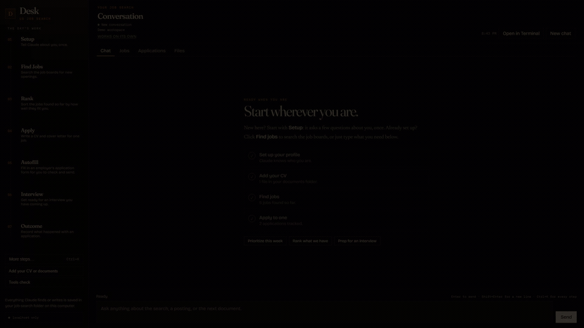

<p align="center">
  
  &nbsp;&nbsp;
  
</p>

# Job Search Desk

*A US job search that runs on your machine. Install the Desk, or clone the repo and talk to Claude Code.*

<p align="center">
  <a href="https://github.com/iLevyTate/ai-job-search/actions/workflows/ci.yml"></a>
  <a href="https://github.com/iLevyTate/ai-job-search/actions/workflows/desk-release.yml"></a>
  <a href="https://github.com/iLevyTate/ai-job-search/releases/latest"></a>
</p>

<p align="center">
  <a href="assets/desk-tour.mp4"></a>
</p>

Setup, the Jobs list, Apply, and Autofill. Autofill never clicks Submit in a released build; see the note on end-to-end submission below. [Full video](assets/desk-tour.mp4).

This repository is the public **US** product: English defaults, US job boards, and an installable **[Job Search Desk](https://github.com/iLevyTate/ai-job-search/releases/latest)** for Windows, macOS Apple Silicon, and Linux. Open the app or clone the repo, run `/setup` once, then scrape, rank, tailor a CV and cover letter, and prep interviews. Claude Code is the runtime. Your profile and applications stay in a folder on your computer.

It is not the original Danish-market template. Methodology started there; this repo is a separate build with its own Desk app, release train, and North American defaults.

> Independent open-source project. Not affiliated with, endorsed by, or maintained by Anthropic. Claude Code is the toolchain this workflow uses.
>
> No cryptocurrency, token, or paid sponsorship program. Anything claiming otherwise is a scam.

## Install Job Search Desk

Download the latest installer from **[Releases](https://github.com/iLevyTate/ai-job-search/releases/latest)**.

| OS | Installer |
| --- | --- |
| Windows | `JobSearchDesk-*-win-x64.exe` (NSIS: replace or keep the old app) or the portable `.exe` |
| macOS Apple Silicon | `JobSearchDesk-*-mac-arm64.dmg` |
| Linux | `JobSearchDesk-*-linux-x86_64.AppImage` |

Release CI does **not** build Intel Mac. Apple Silicon only on macOS.

1. Run the installer. Windows adds Start Menu and Desktop shortcuts and launches the app. If Windows SmartScreen says it protected your PC, click **More info**, then **Run anyway**. That warning is a missing signature, not a virus scan. macOS: open the `.dmg` and drag the app to Applications. Linux: mark the AppImage executable and run it.
2. Open an existing job-search folder, or create a new copy of this public repo (Git is optional).
3. The desk starts Claude Code when it opens. If Claude Code is missing, it runs Anthropic's official installer by piping `https://claude.ai/install.ps1` into PowerShell on Windows, or `https://claude.ai/install.sh` into bash elsewhere. If you are signed out, **Sign in to Claude Code** opens a terminal window with Claude Code's own sign-in; finish it there with your Claude plan or an Anthropic Console API key. Desk never sees the code or token.
4. If Claude in Chrome is missing, click **Add Claude in Chrome** on first run or the sign-in card. Chrome opens the official store. Add the extension; Desk uses it after that. The installer cannot pack a Chrome extension.
5. After you are signed in, run **Setup** once so the folder has your profile.

A second click of the shortcut focuses the window that is already running. It does not start a second desk.

macOS Gatekeeper: the release is unsigned. In Finder, right-click the app, then **Open**.

Updates: packaged Windows and Linux builds check this repository's [Releases](https://github.com/iLevyTate/ai-job-search/releases) on launch and, when a newer version exists, offer a Download button. Nothing is fetched until you click it; after the download, Restart installs it. Portable builds and macOS skip the check and link you to Releases instead.

The app does not replace `/setup`. Autofill never clicks Submit in a released build.

## Run the demo page

To walk the live page without your own hunt files:

```bash
cd gui
npm run dev:demo
```

`npm run record` captures that same demo page.

From a clone, the same desk starts with:

```bash
node gui/server.mjs
```

Terminal instead of the page:

```bash
node gui/server.mjs --cli
```

See [gui/README.md](gui/README.md).

## What you get

```
/setup          /scrape              /apply <url>          /autofill <url>
  |                |                     |                       |
  v                v                     v                       v
Fill in        Search US            Evaluate fit           Prefill the
your profile   boards + ATS         Score & recommend      employer's form
  |                |                     |                       |
  v                v                     v                       v
Profile        Present matches      Draft CV + Cover Letter  Screenshot +
files ready    with fit ratings     (LaTeX, tailored)        field report
                   |                     |                       |
                   v                     v                       v
               Pick a match         Reviewer agent critiques  YOU review
               -> /apply            -> Revise -> Final output  and submit
```

**`/autofill` never clicks Submit in any released build.** It fills the form, attaches your tailored documents, screenshots the result, and hands the browser to you. Automated submission on LinkedIn, Indeed, and Dice violates their Terms of Service.

**End-to-end submission exists, on a branch, and is not released.** This fork has built the last step: an opt-in Submit that presses the employer's own button. It lives on `autofill-submit` and is in no tag, no release, and not on `master`, so nothing you download today can send an application. It is written down here rather than announced later, because a capability like this should be public before it ships, not after.

What gates it, if you build that branch yourself:

- The review gate gained a third answer. It was Continue or Cancel; it is now Continue, Cancel, or Submit. You type `submit` in a terminal, or press **Submit for me** in the Desk.
- The two gates fail closed differently, and the difference is worth stating. The Desk gate returns Cancel on every path that is not an explicit answer: a refused start, a missing token, a failed readiness call, a bad response, a closed review, an abort, an exception, or thirty minutes of silence. The terminal gate has no timer and no check for whether a terminal is attached; anything typed that is not `submit`, including the word cancel, is treated exactly like Enter and closes the browser without sending, while end of input, a closed stdin and an error return Cancel.
- Neither gate can be answered by a flag. The environment chooses which gate runs rather than what it replies, with one honest exception: `JOB_SEARCH_DESK_REVIEW_URL` selects the server the Desk gate asks, so pointing it at a server you control amounts to answering it. That is a capability on your own machine, not a remote one, and it is why the review token is ephemeral and issued by the Desk.
- LinkedIn, Indeed, and Dice refuse to send at all. Their terms forbid it, the block is on the hostname, and the refusal is reported rather than passed over quietly.
- Only an exact button label matches: Submit, Submit application, Send application, Send my application. A newsletter or search button cannot be mistaken for the application's own.
- One decision sends one application. There is no batch mode.

So the last decision stays yours. What changed is who performs the click: you used to press the button in the browser, and on that branch you authorize it and the tool presses it.

Discovery defaults to LinkedIn, Indeed, Dice, Built In, Wellfound, ClearanceJobs, USAJobs, freehire.me, and employer ATS boards on Greenhouse, Lever, Ashby, and Workday. Danish portal CLIs still ship, disabled, so methodology updates do not flip the default search path.

## Prerequisites

- [Claude Code](https://claude.com/claude-code) (the Desk installer can install it). Other agent CLIs can use the portal skills in [AGENTS.md](AGENTS.md).
- Python 3.10+
- [Bun](https://bun.sh) (job search and autofill CLIs)
- Chromium via Playwright (for `/autofill`; installed below)
- LaTeX with `lualatex` and `xelatex`: [TeX Live](https://tug.org/texlive/), [MacTeX](https://tug.org/mactex/), [TinyTeX](https://yihui.org/tinytex/), or [MiKTeX](https://miktex.org/). CV compiles with `lualatex`; cover letter compiles with `xelatex` (`cover.cls` needs `fontspec`). Minimal TeX installs need the extra packages in [SETUP.md](SETUP.md#minimal-tex-install-tinytexbasictex).
- Optional: `pypdf` (`pip install pypdf`) and/or `pdftotext` from [poppler](https://poppler.freedesktop.org/). `/apply` uses `python tools/verify_pdf.py` for the ATS parseability check.

## Start from a clone

```bash
gh repo clone iLevyTate/ai-job-search
cd ai-job-search
```

> [!IMPORTANT]
> **A GitHub fork of a public repo is always public.** `/setup` writes personal data (name, contact details, employment history, salary expectations) into **tracked** files. For your own job search, create a **private** repository and add this repo as `upstream`. The two-minute recipe is in [SETUP.md section 8](SETUP.md#8-pulling-upstream-updates-into-your-fork). Fork only when you intend to contribute.

### Install job search tools

PowerShell:

```powershell
$tools = @("linkedin-search", "freehire-search", "ats-autofill")
foreach ($tool in $tools) {
  Push-Location ".agents/skills/$tool/cli"
  bun install
  Pop-Location
}
Push-Location ".agents/skills/ats-autofill/cli"
bunx playwright install chromium
Pop-Location
```

Bash / zsh / Git Bash:

```bash
for tool in linkedin-search freehire-search ats-autofill; do
  (cd .agents/skills/$tool/cli && bun install)
done
(cd .agents/skills/ats-autofill/cli && bunx playwright install chromium)
```

`linkedin-search` and `freehire-search` have zero runtime dependencies. `ats-autofill` needs Playwright Chromium.

### Set up your profile

```bash
claude
# Then inside Claude Code, or from the Desk:
/setup
```

`/setup` can read a populated `documents/` folder, import a CV pasted in chat, or walk through an interview.

### Search, then apply

```bash
/scrape
/apply https://job-boards.greenhouse.io/acme/jobs/1234567
```

If the URL cannot be fetched (Indeed, Dice, and LinkedIn block automated access), paste the posting:

```bash
/apply <paste the full job description here>
```

Postings are untrusted input. Details in [SECURITY.md](SECURITY.md).

## Other commands

- **`/interview`** builds a stage-specific prep pack from the application's archive and offers a mock interview.
- **`/outcome`** records what happened, archives the materials you submitted, and can draft a follow-up (never sends).
- **`/notion-sync`** publishes a one-way, read-only pipeline view into Notion. Repo files stay the system of record.
- **`/gmail-sync`** reads Gmail for status signals and proposes tracker updates for you to approve.
- **`/rank`** batch-scores scraped postings and returns a shortlist.
- **`/import`** ingests postings you found yourself into the scraper's store, so they dedupe against future scrapes and feed `/apply` and `/autofill` directly.
- **`/expand`** enriches your profile from public sources you already linked.
- **`/upskill`** maps skill gaps against tracked and ranked postings and drafts a learning plan.
- **`/html-report`** writes a self-contained offline dashboard from `job_search_tracker.csv`.
- **`/add-template`** registers your own CV or cover letter toolchain.
- **`/add-portal`** scaffolds a search skill for another job board.
- **`/reset`** wipes profile data after you type `RESET`. See [Starting over](#starting-over).

## File structure

```
ai-job-search/
├── CLAUDE.md                          # Candidate profile + workflow rules
├── .claude/commands/                  # /apply, /scrape, /setup, ...
├── .claude/skills/                    # Application, scraper, and upskill skills
├── .agents/skills/                    # Portal CLIs (US enabled; Danish disabled)
├── application_profile.example.json   # Autofill profile template
├── cv/                                # Stock ATS resume template
├── cover_letters/                     # cover.cls + fonts
├── templates/                         # Custom templates from /add-template
├── documents/                         # Source materials for /setup
├── .github/workflows/desk-release.yml # Desk installers on desk-v* tags
├── gui/                               # Job Search Desk (Electron + localhost)
├── tools/                             # Lint, PDF verify, upstream preview
├── job_scraper/                       # Scraper state
├── job_search_tracker.csv             # Application tracker
└── SETUP.md                           # Detailed setup guide
```

## How `/apply` works

1. **Parse** the posting (URL or text)
2. **Evaluate fit** against your profile
3. **Draft** a tailored CV and cover letter in LaTeX
4. **Spawn a reviewer agent** that researches the company and critiques the drafts
5. **Revise** from that critique
6. **Compile and inspect** both PDFs (`lualatex` for the CV, `xelatex` for the cover letter) until the CV is 2 pages and the cover letter is 1 page
7. **ATS-check the CV** with `python tools/verify_pdf.py`: contact details as literal text, sane reading order, honest keyword coverage
8. **Present** the final output with a verification checklist

Claims are checked against your profile. The workflow does not invent skills or jobs.

What that is for: LaTeX that "looks fine in the `.tex`" still orphans job titles, spills a cover letter onto page 2, or embeds a text layer an ATS cannot read. `/apply` compiles, reads the pages, and extracts the text layer before you send anything.

## Customization

| File | What to change |
|------|----------------|
| `CLAUDE.md` | Full profile |
| `01-candidate-profile.md` | Structured CV data |
| `02-behavioral-profile.md` | Behavioral assessment |
| `04-job-evaluation.md` | Skill areas, goals, filters |
| `05-cv-templates.md` | Profile-statement templates |
| `07-interview-prep.md` | STAR examples from real work |
| `search-queries.md` | Search queries for your skills and location |

Reconfigure search without a full reset:

```
/setup --section search
```

Register your own CV or cover letter toolchain with `/add-template`. Add another US board with `/add-portal`. If that board's terms prohibit automated access, the new skill is created **off**; you turn it on yourself.

Enabled by default:

- **`freehire-search`**: [freehire.me](https://freehire.me) public API. Self-hostable via [strelov1/freehire](https://github.com/strelov1/freehire).

Installed, off until you turn it on:

- **`linkedin-search`**: LinkedIn's User Agreement prohibits scraping, so `/scrape` skips it. Set `enabled: true` in `.agents/skills/linkedin-search/SKILL.md` if you accept that risk yourself. A release leaves it off.

Portal skills you copy from elsewhere should be read in full before you run them. They execute on your machine against your career data.

### Salary benchmarking

Optional. Provide your own data. See `tools/README_SALARY_TOOL.md`. If the file is missing, `/apply` skips the step.

### Starting over

```
/reset profile    # clears skill files, keeps framework rules
/reset documents  # deletes files from documents/
/reset all        # both
```

`/reset` lists what it will delete and waits for you to type `RESET`.

### Staying up to date

Prefer tagged [releases](https://github.com/iLevyTate/ai-job-search/releases) of this repo over raw `master`. `python3 tools/check_upstream_updates.py` previews which personalized files an update touches. Walkthrough in [SETUP.md, section 8](SETUP.md#8-pulling-upstream-updates-into-your-fork).

## Tips

A thin profile produces generic applications. Describe what you actually did: projects, tools, numbers. Skills in context beat a keyword list.

Two search modes both work: you already know the roles you want, or you want the system to surface paths from the work you have already done. `/setup` is the place to say what energized you and what you want more of.

## Contributing

PRs for this repo go to [iLevyTate/ai-job-search](https://github.com/iLevyTate/ai-job-search). Desk, US boards, and this product's docs land here. Read [CONTRIBUTING.md](CONTRIBUTING.md) first.

## Acknowledgements

Workflow methodology began in [MadsLorentzen/ai-job-search](https://github.com/MadsLorentzen/ai-job-search). Portal CLI skills started with [Mikkel Krogholm](https://github.com/mikkelkrogsholm). Runtime is [Claude Code](https://claude.com/claude-code).

## License

MIT
